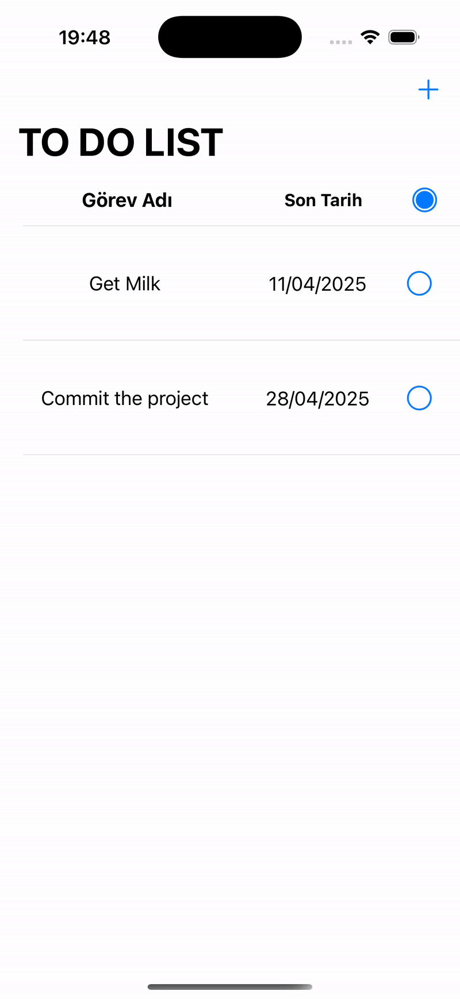

# 📝 To-Do List App

A clean, efficient, and user-friendly **To-Do List app** built with **Swift**, **Core Data**, and **MVVM architecture**. Easily manage your daily tasks with features like adding, editing, completing, and filtering tasks — all wrapped in a simple yet elegant UI.

---

## ✨ Features

- **➕ Add New Tasks**  
  Create tasks with a name, description, and due date.

- **🔍 View Task Details**  
  Tap on any task to see its full details — including creation date, due date, and completion status.

- **✅ Mark as Completed**  
  Complete tasks with a single tap. Completed tasks are moved to the bottom of the list for clarity.

- **✏️ Edit or 🗑 Delete Tasks**  
  Swipe on a task to quickly edit its details or delete it entirely.

- **📂 Filter Completed Tasks**  
  Use the "Show Completed" button to view only tasks that are marked as done.

---

## 📲 How to Use

### Adding a Task
1. Tap the **"+"** button in the top-right corner.
2. Fill out the form: enter the task name and description.
3. Choose a **due date** via the date picker.
4. Tap **"Submit"** to save the task.

### Viewing Task Details
- Tap any task from the list to open the **detail view**.
- You’ll see its full information, including creation date and completion status.

### Marking as Completed
- Tap the **"Completed"** button next to a task.
- The task will move to the bottom and be marked as done.

### Editing or Deleting
- **Swipe left** on a task to reveal **Edit** and **Delete** options.
- Tap **Edit** to update the task.
- Tap **Delete** to remove it from the list.

### Filtering
- Tap **"Show Completed"** to filter and view only completed tasks.

---

## 🛠 Technical Details

- **Language:** Swift  
- **Frameworks:** UIKit, Core Data  
- **Architecture:** MVVM (Model-View-ViewModel)  
- **Persistent Storage:** Core Data  

---

## 🧠 MVVM Breakdown

This project is built using the **MVVM (Model-View-ViewModel)** design pattern for better code organization and maintainability.

- **Model**:  
  `ToDoListItem` — Represents the data structure of a task, including its properties like name, description, and dates.

- **View**:  
  All the UI components such as task list, detail view, and input forms that interact with the user.

- **ViewModel**:  
  Encapsulates the logic for adding, updating, deleting, and fetching tasks. It communicates with the `CoreDataManager` to persist data and exposes observable data to the views.

By separating concerns, MVVM allows the app to be **more testable**, **scalable**, and **cleanly structured**.

---

## 🎬 Demo

---

## 🤝 Contributing

Feel free to fork the repository, submit issues, or make pull requests if you want to improve the project. Contributions are always welcome!

---

## 📄 License

This project is licensed under the MIT License - see the [LICENSE](LICENSE) file for details.
